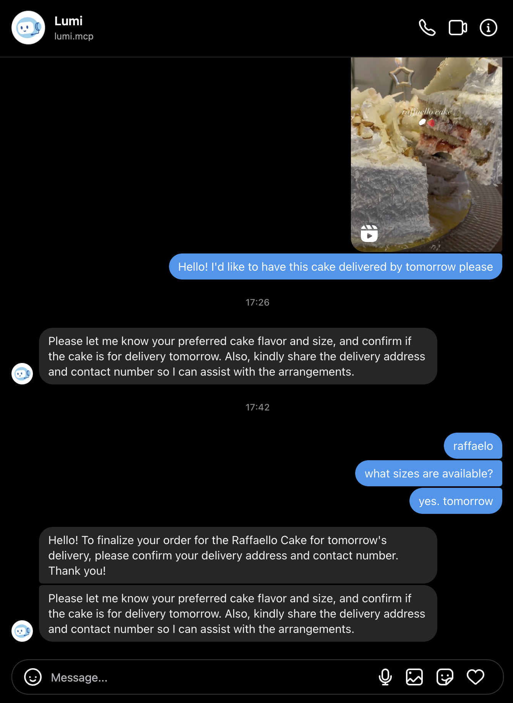

# Bakery Customer Support Agent

This project is an entry for the [Unhinged MCP Buildathon](https://campus.buildclub.ai/challenges/01978a6b-c2b7-7647-bdf5-b83c7888aef2) hosted by Gala Labs via [Build Club](https://buildclub.ai/).
It makes use of multi-agent collaboration using [Fast Agent](https://fast-agent.ai/) to automate customer inquiries and product orders. It features a conversational Instagram Bot for a bakery. It combines multi-agent collaboration, Instagram DM support, and custom tools via the MCP protocol.



## 🚀 Key Features

- Handles customer inquiries, cake orders, and escalations
- Works with Instagram DMs using [Instagram DM MCP](github.com/trypeggy/instagram_dm_mcp)
- Supports LLM configuration (Azure OpenAI / Gemini)
- Modular, extensible agent architecture using FastAgent
- Includes Bakery-specific and Instagram-specific MCP servers

### 🛠️ Architecture & Tech Stack

- MCP (Model Context Protocol):
  - Instagram MCP
  - Bakery MCP – custom tools for menu, pricing, orders
- FastAgent – orchestrates multi-agent workflows (Instagram Manager, Bakery Assistant)
- LLM Backends – Gemini for similarity search. Azure OpenAI or any other LLM of your choice for Agents

### ⚠️ Limitation and Learnings

- Message History Noise
    Agents process entire chat threads, including old messages, which can confuse context and lead to irrelevant responses.
- Single-Agent Overload 
    Overloading one agent with too many tasks leads to failures (e.g., generating replies but not sending them). Task delegation across multiple agents improved reliability.
- Complexity Overhead
    Using many agents helps with complex tasks but makes simple queries (like greetings) harder to handle. Balancing simplicity and power is difficult.
- Unreliable Tool Use
    Agents often struggle with planning and executing multi-step tool calls correctly.
- Prompt Trade-offs
    Detailed system instructions improve accuracy but reduce the agent’s flexibility and creative responses.
- No Real-Time Message Trigger
    The Instagram Manager Agent doesn’t auto-respond to new messages—it must be run repeatedly. A real-time listener would simplify this and improve responsiveness.

### ✨ Potential Areas for Improvement

- Database Integration
    Orders are currently saved as CSV files. Replacing this with a proper database (via form submission) would improve reliability and scalability.
- Informal Language Understanding
    Improve the agent's ability to interpret casual or unstructured language for better natural conversation handling.
- Human Escalation via Chat
    Currently, human handoff requires terminal input. Allowing escalation directly within the chat UI would streamline support.
- Intelligent Upselling
    Train agents to suggest upgrades or add-ons (e.g. larger cakes, custom messages) in a friendly way without being too pushy.
- Contextual Date Handling
    Enhance understanding of relative terms like “tomorrow” or “next Friday” to log accurate delivery dates.
- Payment Workflow Integration
    Add support for payment confirmation and image-based QR code sharing directly in the chat.
- Image-Based Inference
    Enable agents to process customer-sent images (e.g., screenshots, reference cakes) to identify intended products more accurately.
- Media-Rich Responses
    Improve conversations by sharing relevant images or Instagram posts of cakes based on customer preferences or queries.
- Delivery Scheduling
    Add structured options for customers to choose preferred delivery date, time, and location during the ordering flow.


## 🔧 Setup

First, install uv: https://docs.astral.sh/uv/getting-started/installation/

Then, create a virtual environment and install the dependencies:

```bash
uv venv
source .venv/bin/activate
uv sync
```

### Configure LLM

Copy the example secrets file and configure the LLM in `fastagent.secrets.yaml` and `fastagent.config.yaml`

```bash
cp insta_bot/fastagent.secrets.yaml.example insta_bot/fastagent.secrets.yaml
```

Gemini API is being used for similarity search. Get your `GEMINI_API_KEY` from [Google AI Studio](https://aistudio.google.com/apikey). Copy `.env.example` inside `bakery_mcp`. Setup your key here.

```bash
cp bakery_mcp/.env.example bakery_mcp/.env
```

**For Azure OpenAI API**
Fill in the Azure OpenAI API key, endpoint, and deployment name.
For more details, see [Azure OpenAI Configuration guide](https://fast-agent.ai/ref/azure-config/#prerequisites)

### Run the MCPs

We have re-configured the MCPs to make them available through `http` protocol.

Setup your instagram `INSTAGRAM_USERNAME` and `INSTAGRAM_PASSWORD` in `.env` inside the `insta-mcp` folder. 

To prevent having your account blocked due to "suspicious login attempt", save your device settings using `cl.dump_settings('/tmp/dump.json')`

For more details: refer here- https://subzeroid.github.io/instagrapi/usage-guide/interactions.html

Then, run the Instagram MCP server:

```bash
uv run insta_mcp/mcp_server.py
```

Next run the Bakery MCP server.

```bash
uv run bakery_mcp/mcp_server.py
```

### Run the Agents

The agents have been implemented using [Fast Agent](https://fast-agent.ai/).
Fast Agent enables you to create and interact with sophisticated Agents and Workflows in minutes. It's multi-modal - supporting Images and PDFs in Prompts, Resources and MCP Tool Call results.

The Bakery Assistant Agents are located in `agent_bakery_assistant.py`. You can interact directly with this assistant using the following command:

```bash
cd insta_bot
uv run agent_bakery_assistant.py
```

You need to run the bakery assistant as an MCP server:

```bash
uv run agent_bakery_assistant.py --server --transport sse --port 4400
```

From another terminal, start the Instagram Manager Agent:

```bash
uv run agent_insta_manager.py
```

Now, you can instruct the instagram manager agent to do its job. If it finds any pending messages, it will refer to the bakery's MCP to come up with a response and send the message to the customers.

### Debugging MCPs

Run the inspector:

```bash
npx @modelcontextprotocol/inspector
```

Choose the `Streamable HTTP` transport type, and the url `http://localhost:4300/bakery-mcp`. After clicking the `connect` button, you can interact with the MCP from the tools tab.
